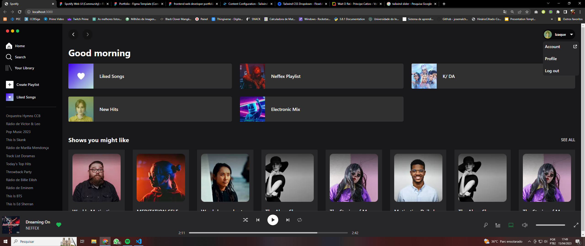

### 👨‍💻 Telas
## 

### Tela principal


### ℹ Sobre
##
Projeto de criação de interface do Spotify, usando NextJs + TailwindCSS 👩‍💻
### ⛏ Ferramentas
##

- [NextJS](https://nextjs.org/)

- [TailwindCSS](https://tailwindcss.com/)

- [Typescript](https://www.typescriptlang.org/)
 
 
### 👩‍💻 Como contribuir
#### 1. Clone o repositório do projeto
```
$ git clone https://github.com/IzaqueNunes/spotify-interface-with-nextJs-and-Tailwind.git
```
#### 2. Acesse a pasta
```
$ cd spotify-tailwind
```
#### 3. Instale as dependencias
```
$ npm install
```
#### 4. Rode o projeto
```
$ npm run dev
```
